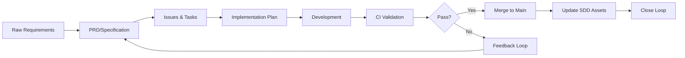

# SDD Lifecycle

The Spec-Driven Development lifecycle is a mandatory process that transforms ideas into working software through executable specifications. This document defines the canonical lifecycle, acceptance gates, and enforcement mechanisms.

## Lifecycle Phases



## Phase 1: Requirements → Specification

### Input
- Feature ideas, user needs, business requirements
- Can be vague, incomplete, or high-level

### Process
1. Use `/specify` command or `create-new-feature.sh` script
2. Transform requirements into structured PRD using `spec-template.md`
3. Iterative refinement with AI agents to clarify ambiguities
4. Document user stories with acceptance criteria
5. Identify edge cases and non-functional requirements

### Output
- Feature branch (NNN-feature-name)
- Complete specification in `specs/NNN-feature-name/spec.md`
- All [NEEDS CLARIFICATION] markers resolved

### Acceptance Gates
- [ ] User stories have testable acceptance criteria
- [ ] Requirements are unambiguous
- [ ] Edge cases documented
- [ ] Non-functional requirements specified
- [ ] Review checklist completed

## Phase 2: Specification → Issues & Tasks

### Input
- Approved specification from Phase 1

### Process
1. Decompose specification into trackable issues
2. Create task plan with dependencies
3. Assign task IDs (TASK-###)
4. Define implementation order
5. Estimate effort and complexity

### Output
- GitHub Issues for major features
- `ISSUES-TASK-PLAN.md` with numbered tasks
- Task dependency graph
- Acceptance criteria per task

### Acceptance Gates
- [ ] All spec requirements mapped to tasks
- [ ] Task dependencies identified
- [ ] Each task has clear deliverables
- [ ] Task IDs assigned and unique
- [ ] Effort estimates provided

## Phase 3: Issues → Implementation Plan

### Input
- Task plan from Phase 2
- Technical context and constraints

### Process
1. Use `/plan` command or `setup-plan.sh` script
2. Map requirements to technical decisions
3. Define architecture and design patterns
4. Create data models and API contracts
5. Document technology choices with rationale

### Output
- `plan.md` with phased implementation approach
- `data-model.md` with schemas
- `contracts/` with API specifications
- `research.md` with technical investigations
- `quickstart.md` for developer onboarding

### Acceptance Gates
- [ ] Simplicity Gate: Minimal viable approach
- [ ] Anti-Abstraction Gate: Direct framework usage
- [ ] Integration-First Gate: Contracts defined
- [ ] Test-First Gate: Test strategy documented
- [ ] Security Gate: No hardcoded secrets

## Phase 4: Plan → Development

### Input
- Implementation plan from Phase 3
- Task assignments

### Process
1. Follow Test-Driven Development cycle:
   - Write tests first (red phase)
   - Implement to pass tests (green phase)
   - Refactor for quality
2. Commit with task references: `type(scope): message [TASK-###]`
3. Use git worktrees for parallel development
4. AI agents work within defined boundaries

### Output
- Working code that passes tests
- Commits linked to tasks
- Documentation updated
- Test coverage reports

### Acceptance Gates
- [ ] Tests written before implementation
- [ ] All tests passing
- [ ] Code follows project conventions
- [ ] Commits reference tasks
- [ ] Documentation current

## Phase 5: Development → CI Validation

### Input
- Pull request with implementation

### Process
1. Automated CI workflows trigger:
   - SDD structure validation
   - Documentation style checks
   - Unit and integration tests
   - Linting and formatting
   - AI code review
2. Validation results posted to PR
3. Required checks must pass

### Output
- CI validation report
- AI review comments
- Test coverage metrics
- Performance benchmarks

### Acceptance Gates
- [ ] SDD validation passes
- [ ] Tests green
- [ ] Documentation linted
- [ ] No unresolved [NEEDS CLARIFICATION]
- [ ] Task traceability verified

## Phase 6: Validation → Merge Decision

### Input
- CI validation results
- Review feedback

### Decision Criteria
**Pass Path:**
- All required checks green
- AI review concerns addressed
- Human approval obtained
- No blocking issues

**Fail Path:**
- Actionable feedback provided
- Issues documented
- Return to appropriate phase
- Update specs if needed

### Output
- Merge to main branch OR
- Feedback for iteration

## Phase 7: Merge → Asset Updates

### Input
- Merged changes

### Process
1. Update SDD artifacts if needed:
   - Specifications evolved
   - Plans refined
   - Templates improved
2. Version increment if applicable
3. CHANGELOG.md updated
4. Release notes prepared

### Output
- Updated documentation
- Version tags
- Release artifacts
- Deployment readiness

## Phase 8: Close Loop

### Input
- Production metrics
- User feedback
- Incident reports

### Process
1. Analyze operational data
2. Identify specification gaps
3. Document learnings
4. Propose amendments
5. Feed back to Phase 1

### Output
- Lessons learned document
- Specification improvements
- Process refinements
- Constitution amendments (if needed)

## Enforcement Mechanisms

### Automated Enforcement
- CI/CD workflows block non-compliant changes
- Pre-commit hooks validate structure
- Branch protection rules enforce reviews
- Automated task tracking

### Manual Enforcement
- Code review checklist
- Architecture review board
- Sprint retrospectives
- Compliance audits

### Escalation Path
1. CI validation failure → Developer fixes
2. Repeated failures → Team lead review
3. Process violations → Architecture review
4. Constitutional conflicts → Governance board

## Traceability Requirements

Every artifact must maintain traceability:

```
Requirement (Spec) → Issue → Task → Commit → Test → Deployment
```

### Traceability Markers
- Specifications: Referenced by issue number
- Issues: Link to spec sections
- Tasks: `[TASK-###]` in commits
- Commits: Reference tasks and issues
- Tests: Map to requirements
- Deployments: Tag with version

## Parallel Execution

### Git Worktrees
Enable parallel development streams:
```bash
# Feature development
git worktree add ../sdd-task-001-api feature/001-api

# Bug fix
git worktree add ../sdd-task-002-bugfix bugfix/002-security

# Experimentation
git worktree add ../sdd-task-003-experiment experiment/003-new-ui
```

### Agent Isolation
- Each worktree has dedicated agent session
- No cross-contamination between tasks
- Clear boundaries and permissions
- Separate MCP server instances

## Metrics & Monitoring

### Process Metrics
- Cycle time per phase
- Defect escape rate
- Specification stability
- Task completion velocity
- Test coverage trends

### Quality Metrics
- Specification completeness
- Requirements coverage
- Defect density
- Code review findings
- Performance benchmarks

## Continuous Improvement

### Regular Reviews
- Weekly: Task progress
- Sprint: Phase transitions
- Monthly: Process metrics
- Quarterly: Constitutional review

### Feedback Channels
- Developer surveys
- Retrospectives
- Incident post-mortems
- Customer feedback
- Agent performance logs

---

*Version: 1.0.0 | Effective Date: 2025-09-09 | Next Review: 2025-12-09*